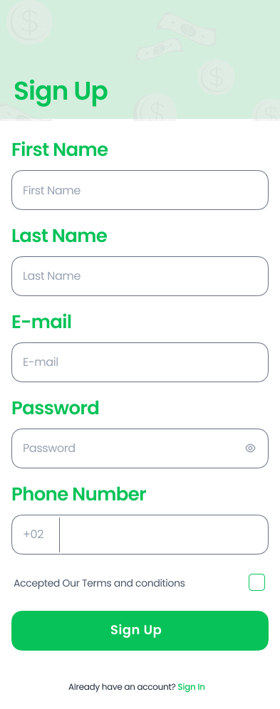
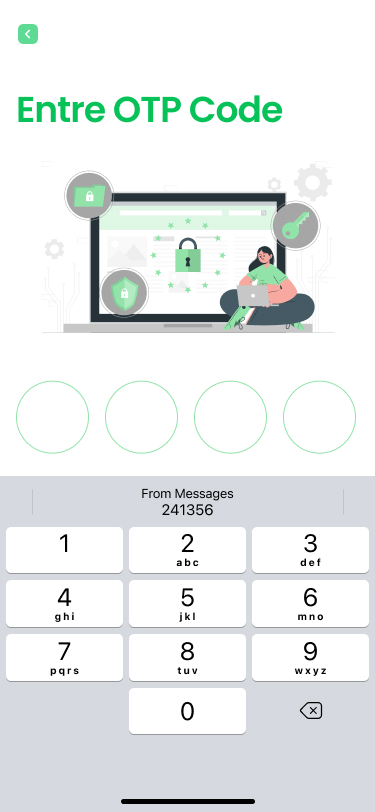
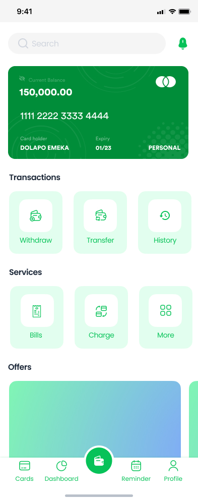

# Tap Cash 

The Tap Cash e-Wallet app is a fintech solution that 
simplifies the way users manage their finances. The app 
includes a range of features such as e-wallet, smart 
card, kids smart card, dashboard, and transfer and 
withdraw. The app's unique selling proposition (USP) is 
the ability to simplify finances, promote responsible 
spending, and provide valuable insights into spending 
patterns.

| Splash Screen | On Board1 Screen                       |
|------|-------------------------------------------|
||  |
| On Board2 Screen  | On Board3 Screen                       |
|  |  |
| On Board4 Screen  | On Board5 Screen                       |
|  |  |
| Sign Up Screen  | Sign In Screen                       |
|  |  |
| Forget Password Screen  | Otp Screen                       |
|  |  |
| Home Screen  | kids Smart Card Screen                       |
|  |  |

